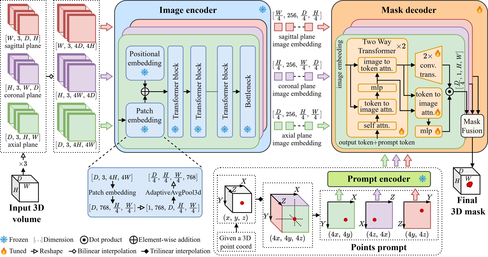
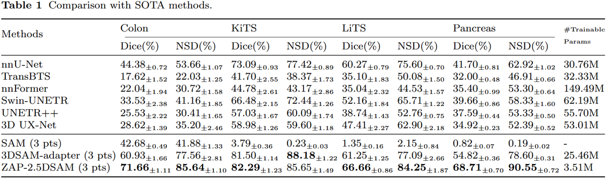
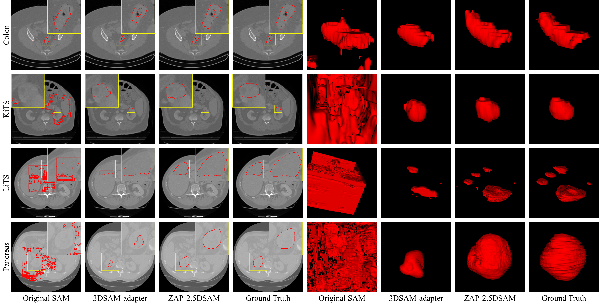

# ZAP-2.5DSAM: Zero Additional Parameters Advancing 2.5D SAM Adaptation to 3D Tumor Segmentation
by Cai Guo, Yuxi Jin, Bishenghui Tao, Jianzhong Li, [Hong-Ning Dai](https://www.henrylab.net), [Ping Li](https://www.comp.polyu.edu.hk/~pinli).

Pytorch Implementation for the paper "ZAP-2.5DSAM: Zero Additional Parameters Advancing 2.5D SAM Adaptation to 3D Tumor Segmentation"


### Comparision with SOTA methods


### Visualization of The Segmentation Results


## Datasets
We adopted the same data partitioning strategy employed in the [[3DSAM-adapter]](https://github.com/med-air/3DSAM-adapter) presented by Shizhan Gong et al.

## Dependencies
```
conda create -n zap2.5dsam python=3.11
conda activate zap2.5dsam
conda install numpy=1.26.4
conda install pytorch==2.2.2 torchvision==0.17.2 torchaudio==2.2.2 pytorch-cuda=11.8 -c pytorch -c nvidia
conda install scipy
pip install nibabel
pip install monai==1.3.1
```

## ZAP-2.5DSAM
Our implementation is based on a single NVIDIA RTX 3090 GPU, the total runtime GPU memory footprint of the model during the training and inference phases was around 11 GB and 8.5 GB, respectively, indicating that the proposed method is compatible with GPUs with lower memory capacities, such as the NVIDIA RTX 2080Ti (11 GB VRAM).

To use the code, first download the pre-trained weight of SAM-B from [[here]](https://dl.fbaipublicfiles.com/segment_anything/sam_vit_b_01ec64.pth) and place it in the folder `ckpts`. Then download the datasets and place them in the folder `datasets`.

Running the following command to train the ZAP-2.5DSAM:
```
python train.py
```

Running the following command to test the ZAP-2.5DSAM:
```
python test.py
```

## Acknowledgement
Our code is based on [[Segment-Anything]](https://github.com/facebookresearch/segment-anything) and [[3DSAM-adapter]](https://github.com/med-air/3DSAM-adapter).

## Citation
If you think this work is useful for your research, please cite the following paper.

```
@article{guo2025zap-2.5dsam,
  title={ZAP-2.5DSAM: Zero Additional Parameters Advancing 2.5D SAM Adaptation to 3D Tumor Segmentation,
  author={Guo, Cai and Jin, Yuxi and Tao, Bishenghui and Li, Jianzhong and Dai, Hong-Ning and and Li, Ping},
  journal={The Visual Computer},
  pages={1--11},
  year={2025},
  publisher={Springer}
}
```
